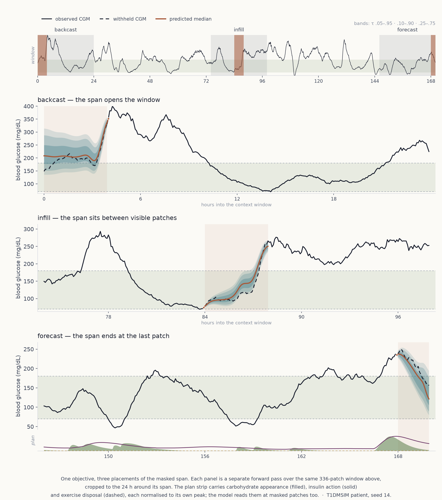
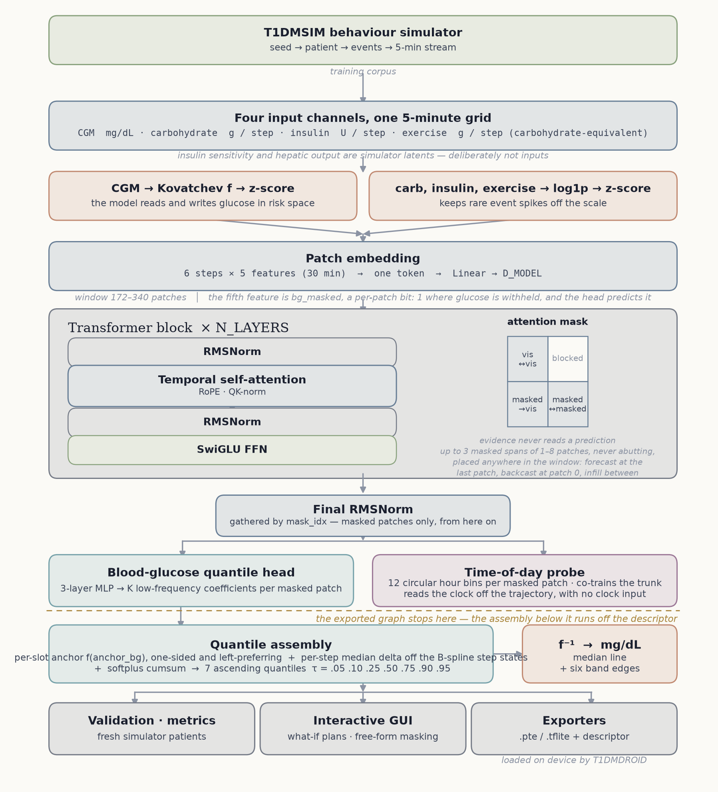
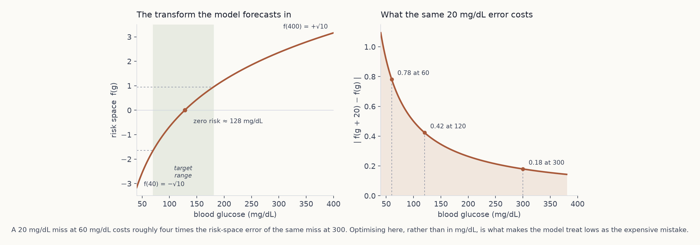

# T1DMAI

An encoder-only transformer that forecasts blood glucose for Type 1 Diabetes.
It reads the three signals a phone can actually observe — CGM, logged
carbohydrate, logged insulin — and returns the next two hours as a fan of seven
quantiles, so every forecast carries its own uncertainty.

Pretrained on synthetic traces from the [T1DMSIM](https://github.com/0xdeadf1sh/T1DMSIM)
behavioural simulator, then fine-tuned on real CGM cohorts. The trained model
exports to ExecuTorch or LiteRT and runs on-device in
[T1DMDROID](https://github.com/0xdeadf1sh/T1DMDROID).

> [!CAUTION]
> **Research and educational use only — not a medical device.** T1DMAI is a
> research artifact. It is **not** clinically validated, has **no** regulatory
> clearance, and its output is a forecast of research signals, not medical
> advice. It **must not** be used to make medical, diagnostic, or treatment
> decisions, to calculate or adjust insulin doses, or to manage diabetes in any
> way. For medical guidance consult a qualified healthcare professional. The
> software is provided "as is", without warranty of any kind (see
> [LICENSE](LICENSE)).

<picture>
  <source media="(prefers-color-scheme: dark)" srcset="screenshots/forecast-dark.png">
  <source media="(prefers-color-scheme: light)" srcset="screenshots/forecast.png">
  
</picture>


## Table of contents

- [Architecture](#architecture)
- [Risk space](#risk-space)
- [Inputs and outputs](#inputs-and-outputs)
- [Training](#training)
- [Fine-tuning on real CGM](#fine-tuning-on-real-cgm)
- [Inference modes](#inference-modes)
- [Results](#results)
- [Trained models](#trained-models)
- [Evaluation harness](#evaluation-harness)
- [Simulator cache](#simulator-cache)
- [Resizing the model](#resizing-the-model)
- [Exporting for on-device inference](#exporting-for-on-device-inference)
- [Interactive GUI](#interactive-gui)
- [Installation](#installation)
- [Quick start](#quick-start)
- [Testing](#testing)
- [Documentation](#documentation)
- [References](#references)
- [Related projects](#related-projects)
- [License](#license)


## Architecture

<picture>
  <source media="(prefers-color-scheme: dark)" srcset="screenshots/architecture-dark.png">
  <source media="(prefers-color-scheme: light)" srcset="screenshots/architecture.png">
  
</picture>

Six consecutive 5-minute samples become one 30-minute token. A pre-norm
transformer stack attends over those tokens with rotary position embeddings,
QK-normalisation, and a learned per-head ALiBi bias, so heads settle on
different temporal scales. Attention is bidirectional inside the context and
inside the horizon; the context is blocked from reading the horizon, so no
future information flows backward.

Two heads read the horizon tokens. The glucose head emits a few low-frequency
coefficients per patch rather than one value per step, so a step-to-step zigzag
is unrepresentable; the median is then projected onto a low-frequency basis
spanning the whole horizon, which smooths across patch seams and — because a
projection can only shrink a signal — bounds the drift away from the last
observed reading. At initialisation the forecast is a flat persistence line.
Spreads pass through a softplus and a floor, then accumulate, so the seven
quantiles are strictly ordered by construction.

The second head is a time-of-day probe: it classifies each horizon patch into
one of twelve two-hour bins. There is no clock input, so it has to infer the
hour from the trajectory alone. It never touches the forecast, but its gradient
does reach the shared trunk, which pushes the same representations the glucose
head reads to encode circadian phase.

The model is patient-agnostic. There is no learned per-patient vector; identity
is whatever the 8–24 hour context window implies.

Every dimension lives in `config.py`, and `resize_model.py` rewrites it. The
released capacities run from 38 k to 17 M parameters on the same code.


## Risk space

<picture>
  <source media="(prefers-color-scheme: dark)" srcset="screenshots/risk-space-dark.png">
  <source media="(prefers-color-scheme: light)" srcset="screenshots/risk-space.png">
  
</picture>

The model does not forecast mg/dL. It forecasts the Kovatchev risk transform of
mg/dL — a warp of the glucose axis that stretches the hypoglycemic range and
compresses the high one. Here it is re-anchored to the physical device range so
that `f(40) = −√10` and `f(400) = +√10`, putting zero risk near 128 mg/dL.

The consequence is the whole point: the same absolute error is worth several
times more loss at 60 mg/dL than at 300. Nothing in the objective mentions
hypoglycemia, and no term is focally reweighted — the clinical asymmetry is
carried entirely by the geometry the loss is measured in. Glucose enters the
model through the same transform, so input, output, target and loss all share
one space. Only the reporting layer converts back to mg/dL.


## Inputs and outputs

Three features per 5-minute step:

| Feature | Units | Transform |
| --- | --- | --- |
| CGM glucose | mg/dL | Kovatchev `f`, then z-score |
| carbohydrate | g / step | `log1p`, then z-score |
| insulin (basal + bolus) | U / step | `log1p`, then z-score |

`log1p` is near-linear near zero, so the dense basal baseline survives while
rare meal and bolus spikes are compressed into the bulk of the distribution.

Insulin sensitivity and hepatic glucose output are simulator latents. A real CGM
cannot supply them, so they are deliberately withheld: the model only ever sees
what deployment will give it. There are no time-of-day features either.

In the prediction zone the glucose slot is blanked — it is what the model
predicts — while the carbohydrate and insulin slots carry the upcoming meals and
doses as their absorption and action curves, per step, in the units above.
The model is therefore *always* conditioned on a declared plan, which is what
makes the what-if mode a property of the forward pass rather than a separate
mode.

The output is `(q_tau, median)` in risk space: seven quantile levels
(5 / 10 / 25 / 50 / 75 / 90 / 95 %) at every 5-minute step, anchored on the last
observed glucose. Inference inverts them to mg/dL.


## Training

Batches are simulated on the fly, or drawn from a pre-generated cache. Each
sample is a fresh random window: the context length is re-rolled per sample
between 8 and 24 hours, and the horizon may start at any patch-aligned position
in the day, so day and night are learned by one model without a band
restriction.

The loss combines two terms, both in risk space:

- **Pinball loss** over all seven quantile levels, which calibrates each level to
  its coverage and pins the median pointwise.
- **DILATE** on the median — a shape term built from a soft dynamic-time-warping
  divergence plus a temporal-distortion term, so a forecast that predicts the
  right excursion a step early is not punished as though it predicted the wrong
  excursion. The temporal term is evaluated as a directional derivative of the
  soft-DTW value, which avoids materialising the alignment matrix.

The two are fused by learned Kendall-Gal homoscedastic uncertainty weights: two
log-variance scalars, trained alongside the model, so the trade-off is learned
rather than fixed.

Other details worth knowing:

- **Muon** for every parameter with `ndim ≥ 2`, the patch-embedding matrix
  included; AdamW for the 1-D ones — norm scales, biases, ALiBi slopes — and the
  two loss-weighting scalars. Muon's decay on the normalised matrices is
  schedule-corrected (AdamC), which removes the end-of-schedule gradient-norm
  rise; at peak learning rate it is identical to plain decoupled decay.
- **Weight EMA** for evaluation. Threshold-crossing metrics like hypo recall are
  sensitive to small parameter jitter, so validation runs under a shadow copy
  and training continues on the live weights.
- **Raw signals throughout.** There is no smoother on the inputs or on the
  target. The same raw post-noise glucose is the input, the target and the
  anchor, so train and deployment distributions match by construction.
- **fp32 everywhere.** No autocast, no bf16 or fp16, no gradient checkpointing —
  though the default CUDA path leaves TF32 matmul on; `DETERMINISTIC = True`
  turns it off.
- **Disjoint partitions.** In cache mode, train, validation and
  conformal-calibration draws are carved into non-overlapping slabs of the pool,
  so a held-out seed cannot reproject onto a training row. On the fly, the seed
  bands are separated by construction.

Validation runs every `VALIDATION_INTERVAL` steps and prints a single table:
per-horizon RMSE and MARD, Clarke Error Grid zones, CG-EGA by glycemic region,
hypo and hyper detection off the band edges, band coverage, excursion amplitude,
nocturnal and night-onset sections, a counterfactual dose-response probe, and
the clock probe's accuracy. The results are appended to
`logs/validation_log.csv`.

```bash
# simulate on the fly
python train.py --master-seed 42 --total-steps 100000 --batch-size 512

# or from a pre-generated pool — see Simulator cache
python train.py --cache-path cache_balanced --total-steps 100000
```


## Fine-tuning on real CGM

Pretraining alone leaves a domain gap. `finetune/` closes it against real
records, reusing the pretraining loss, the Muon/AdamW split and the same
warmup-plus-cosine schedule and EMA machinery — at fine-tuning settings (0.1×
peak learning rate, 100-step warmup, a 0.99 EMA decay) and without the AdamC
decay correction.

```bash
# one cohort, holding out one patient
python finetune/finetune.py --checkpoint checkpoints/t1dmai_best.pt \
    --dataset ohiot1dm --mode transfer --holdout 591

# pool several cohorts, holding out one patient from each
python finetune/finetune_multi.py --checkpoint checkpoints/t1dmai_best.pt \
    --datasets ohiot1dm,azt1d,shanghai
```

Two regimes: `transfer` fine-tunes on every other patient and scores the
held-out one, measuring cross-patient generalisation; `personalize` fine-tunes
on the held-out patient's own calibration split and scores its disjoint test
split.

Real records log events, not curves. `realdata/` parses each cohort into a
canonical gap-free 5-minute segment, then convolves the logged meals and doses
with the simulator's own absorption and action kernels, so the channels the
model sees on real data have the same meaning they had in pretraining.

**What that convolution cannot recover.** A meal's absorption curve depends on
what was eaten, not only on how many grams: the simulator draws a fast/medium/slow
mixture per meal, but none of the real cohorts records glycemic index or food
composition, so every logged meal is convolved with the *same* population-mean
kernel. A bowl of white rice and a plate of lentils of equal carbohydrate weight
therefore enter the model as identical curves, when their true appearance peaks
minutes to hours apart. On ShanghaiT1DM the gap is wider still — carbohydrate
grams are themselves estimated from free-text food weights through a coarse
carb-by-weight table, which is the lowest-fidelity channel in the harness. The
same flattening applies to insulin: a single rapid-action kernel stands in for
every bolus, where the simulator scales duration with dose, and MDI long-acting
analogues are approximated as rapid. Treat the real-cohort channels as a
plausible reconstruction of absorption and action, not a measurement of it.

### A record that already holds its curves

One source escapes that reconstruction. A record authored by the companion
Android app stores, per logged event, the resolved per-five-minute series the app
itself fed the model — an explicit curve where one was built or mixed, otherwise
the parameters that generate it, glycemic index included. `realdata/personal.py`
reads such a record and carries those series through unchanged, so the channels
match what the device produces at inference rather than approximating them.

```bash
python finetune/finetune_personal.py --checkpoint checkpoints/t1dmai_best.pt \
    --db /path/to/record.db --lr-scale 0.05 --steps 400 --eval-interval 25
```

With one patient there is no patient to hold out, so a *day* is held out
instead: the day whose coefficient of variation falls nearest the median of every
complete day the record contains, chosen so the score reflects neither the
calmest day nor the most turbulent. That day is withheld together with the two
before it. Every prediction window carries a full 24 hours of context, so the day
immediately before the scored one is read as its context and also serves as the
calibration split for the conformal fit; the third day is the context that
calibration split in turn reads. No step the fine-tune trained on is consumed as
context by a scored or calibration window. The full per-day ranking is printed at
startup, including days in shorter segments that count toward the median but
cannot host the reservation.

Because the calibration day is also the scored day's context, the residuals
setting the conformal half-width come from the stretch the scored forecasts are
conditioned on. `--val-day` and `--cal-day` override both choices.

The database is opened read-only and never modified; `--skip-hours` (24 by
default) drops the opening hours at load time rather than by deleting rows, which
keeps the insulin and carbohydrate action of earlier events reaching correctly
into what remains. A record of a few weeks yields on the order of a hundred
training windows and a few dozen scoring windows, and windows are strided densely
enough to overlap, which weakens the exchangeability the conformal fit assumes:
the resulting coverage figures are indicative. A gain measured on a single day of
a single person is evidence of adaptation to that record, not of generalisation.


## Inference modes

All three go through `inference.py`. [docs/INFERENCE.md](docs/INFERENCE.md) maps
where each part of the inference contract is implemented here and points at the
suite-wide specification in
[T1DMCOMMON](https://github.com/0xdeadf1sh/T1DMCOMMON), which is what a
non-PyTorch runtime implements against.

**Single pass.** Given 8–24 hours of context, forecast the next two hours as
seven quantiles per 5-minute step. Upcoming carbohydrate and insulin can be
announced to condition the forecast.

**What-if.** The same forward pass with a different declared plan written into
the prediction zone — "what happens if I eat 40 g at six". A baseline forecast
with no doses is just another call.

**Rolling.** For horizons past one window, the median forecast is fed back as
context and the model runs again. Bands widen across roll boundaries by an
accumulated half-width, so uncertainty grows monotonically instead of resetting
at each seam.


## Results

All numbers are mg/dL RMSE at the horizon point, on the point-forecast basis —
the median line, `f⁻¹(median)` — which is the basis published forecasters report.

**Cross-patient, on patients no fine-tune ever saw.** One patient is held out per
cohort (OhioT1DM 591, AZT1D AZ23, ShanghaiT1DM 1003); 213 windows. Each cell is
the pretrained model → the same checkpoint after the three-cohort fine-tune,
scored on the identical split.

| Model | Parameters | @30 | @60 | @120 |
| --- | ---: | ---: | ---: | ---: |
| nano | 37,879 | 26.1 → 17.8 | 32.4 → 26.5 | 45.8 → 36.6 |
| small | 278,723 | 17.8 → 16.5 | 29.0 → 25.7 | 45.8 → 37.4 |
| medium | 2,155,891 | 18.5 → 16.6 | 29.5 → 25.8 | 46.4 → 36.5 |
| large | 16,997,171 | 18.6 → 16.9 | 29.3 → 25.3 | 48.2 → **34.3** |

**Cohort-wide, all 42 patients** (6 + 24 + 12), 1,958 windows on each cohort's
test split — OhioT1DM's canonical one, a late temporal slice for the other two.
Read this as an upper bound, not a generalisation estimate:
the fine-tune pools the complete record of every non-held-out patient, so all but
the three held-out patients' windows are in-sample for the fine-tuned rows. The
simulator-only rows are genuinely out-of-sample — that model never saw real data.

| Model | RMSE @30 | @60 | @120 | MARD @30 | Clarke A @30 | Skill @60 |
| --- | ---: | ---: | ---: | ---: | ---: | ---: |
| nano | 17.3 | 24.1 | 34.7 | 8.4 % | 90.2 % | 0.34 |
| small | 17.0 | 23.9 | 35.1 | 8.2 % | 91.1 % | 0.35 |
| medium | **16.1** | **22.1** | **30.8** | **7.8 %** | **92.4 %** | **0.40** |
| large | 16.7 | 22.8 | 32.8 | 8.1 % | 91.4 % | 0.38 |
| simulator only | 20.0–21.4 | 30.9–31.8 | 50.0–52.2 | 10.1–10.8 % | 86.0–87.3 % | 0.13–0.16 |
| last-value persistence | 23.2 | 36.9 | 55.1 | — | — | — |

Skill is the fractional RMSE reduction against persistence. Clarke A+B sits at
99.1–99.3 % for every fine-tuned row, so zone A alone is shown.

Two things stand out. Accuracy is flat in capacity: across a 450× spread in
parameters the held-out numbers sit within 1.2 mg/dL of each other at 60 minutes,
and the 38 k model is within 1.3 mg/dL of the best at 30. The fine-tune is what
moves the needle — 1 to 14 mg/dL depending on capacity and horizon, against
almost nothing from scaling up.

On its own in-domain distribution — fresh T1DMSIM patients — the simulator-only
models reach 13.1–14.5 mg/dL at 30 minutes and 36.8–39.5 at 120. The gap between
that and the real-cohort numbers is the reality gap the fine-tune exists to close.

Pretraining cost, one GPU, 100,000 steps at batch 512:

| Model | Architecture | Wall clock | Peak GPU |
| --- | --- | ---: | ---: |
| nano | D=32, 2L, 2H, FFN=128 | 2.9 h | 0.6 GB |
| small | D=64, 4L, 4H, FFN=256 | 4.5 h | 2.0 GB |
| medium | D=128, 8L, 8H, FFN=512 | 12.8 h | 7.8 GB |
| large | D=256, 16L, 16H, FFN=1024 | 48.2 h | 30.1 GB |


## Trained models

Twelve checkpoints — four capacities crossed with three training variants
(`sim`, `ohio`, `multi`) — ship out of band with their training logs, per-model
evaluation output and figures. They are not in git.

**Download:** [`T1DMAI_models.tar.gz`](https://drive.google.com/file/d/1B8SHxyxyHTddify6783j8n1g6z1ua_pa/view?usp=sharing) (1.9 GB)

Unpack into `models/`. `models/compare.py` reads all twelve and writes a
cross-model comparison; `models/README.md` documents the layout, the reporting
bases and every figure it produces. All twelve were pretrained on
[`cache_balanced`](#simulator-cache).

Each model ships with the two formal reports, the probes and the scripts that
produced them. The augmentation regime (`metrics_*/augmented/`) is not bundled;
`metrics/augmented/build_report.py` rebuilds it from a checkpoint.

```bash
tar xzf T1DMAI_models.tar.gz
python models/compare.py
```

A checkpoint carries its own architecture in `training_config`, and anything that
builds the model refuses to load one that disagrees with the live `config.py`.
The fine-tuning entry point prints the `resize_model.py` command that would
align them. `models/compare.py` reads the checkpoint dictionaries only, so it
compares all four capacities without any alignment.


## Evaluation harness

`metrics/` scores a checkpoint outside training and reports numbers only.

```bash
bash metrics/rebuild_all.sh
```

That builds two formal reports — the real cohorts as logged, and fresh simulator
patients as an in-domain reference — plus the probes: dose-response and
monotonicity for the what-if path, forecast-vs-true amplitude, excursion
detection split by whether the causal event was logged, meal-schedule comparison
against the simulator, and the clock probe on real CGM. Two more run on their
own: a report on the records after reconstructing the meals and boluses they
omit, which bounds the announced-event regime from above, and the 15-minute
CGM-lag probe.

```bash
python metrics/augmented/build_report.py
python metrics/shift15.py
```

Two scoring bases appear throughout and are not interchangeable. The **median
line** is the genuine point forecast, and the basis every comparison against
published work uses. The **band** basis scores `clip(true, q₂₅, q₇₅)`, charging
zero error wherever the truth lies inside the band; it describes band geometry,
not point accuracy. Every record names the basis it was measured on.

Other tools:

```bash
python calibrate_conformal.py --checkpoint checkpoints/t1dmai_best.pt
python model_health.py --data 128
python make_figures.py && python make_card.py
```

`calibrate_conformal.py` fits a per-step, per-quantile additive band correction
on a disjoint calibration partition and stores it in the checkpoint; it holds
the median fixed and keeps the fan monotone, and must be re-fit per target
distribution. `model_health.py` audits each architecture knob for
over-provisioning or saturation and prints the `resize_model.py` command each
verdict implies.


## Simulator cache

The simulator is a Python loop and starves a fast GPU. The shared generator
pre-builds a pool of post-warmup trajectories once; training then skips the
simulator entirely. This repository ships no cache — download one, or build your
own.

T1DMSIM publishes two, each a million trajectories of 55.5 h at 5-minute
resolution after a 48 h warmup, about 9 GB compressed:
[`cache_balanced`](https://drive.google.com/file/d/1pZuf6Htui-CC3Abp2NAHVvogk99X1ZR3/view?usp=sharing)
and, with hypoglycemia oversampled,
[`cache_hypo`](https://drive.google.com/file/d/1D1tg0GDtzLY_IzrtMkOj1foQhRj3cU9R/view?usp=sharing).
Each unpacks to a directory of that name carrying a `DATASET.md` that describes
what is in it. **The released checkpoints were pretrained on `cache_balanced`.**

```bash
tar xzf t1dmsim_balanced.tar.gz          # unpacks to cache_balanced/
python train.py --cache-path cache_balanced --total-steps 100000
```

To build your own instead:

```bash
python T1DMSIM/cache_simulator.py --out-dir simulator_cache --pool-size 1000000
python train.py --cache-path simulator_cache --total-steps 100000
```

Each channel is a chunked blosc2 array with byte-shuffle and zstd. Byte-shuffle
groups the high-entropy mantissa bytes of each float apart from the low-entropy
exponent bytes, which gives zstd a far more compressible stream than raw IEEE-754
layout. On the published caches that is about 1.3–1.6× on the dense physiologic
channels and 17–630× on the near-constant ones — hour-of-day 86×, day index
633× — for roughly 2.3× over the pool as a whole. An uncompressed `.npy` memmap
layout is also accepted.

Pool reuse is benign, because every draw takes a fresh random window from its
row: a 666-step trajectory admits about 2,112 distinct patch-aligned windows, so
a 1–3 M-row pool is ample for a 100,000-step run at batch 512. The dataset checks
the cache's `meta.json` — format, channel list, warmup and sim hours, `dt`, the
uniform-sample probability — and each channel's shape against the runtime config,
and refuses to train on divergent data. The generation parameters under `params`
are not checked, so two pools built with different hypoglycemia oversampling are
both accepted.


## Resizing the model

`resize_model.py` rewrites `config.py` from explicit override flags. With no
flags it prints the current architecture and parameter count and exits.

```bash
python resize_model.py                                       # inspect
python resize_model.py --d-model 192 --heads 3               # head_dim 64
python resize_model.py --layers 12
python resize_model.py --d-model 256 --heads 4 --report-only  # preview only
```

It instantiates the candidate on the `meta` device to count parameters — the
count is computed from the architecture, never targeted — and prints a
before → after diff. It refuses to write unless `HEAD_DIM ∈ {16, 32, 64, 128}`
(so attention dispatches a fused kernel instead of materialising the full T×T
matrix) and an integer number of patches tiles the hour.


## Exporting for on-device inference

`exporters/` turns a checkpoint into a runtime artifact plus a descriptor. The
engine-agnostic parts — the modified forward, checkpoint loading, the descriptor
emitter — are shared; each engine module owns only its own lowering. Each writes
its artifact and then checks it on host against the eager forward, exiting
non-zero if the delta exceeds tolerance — so a failed export still leaves the
artifact on disk. XNNPACK and LiteRT run the lowered artifact itself; the pip
ExecuTorch runtime carries no Vulkan backend, so that path checks the exported
graph through a portable-CPU lowering and gates the GPU numerics on-device
against the fp32 reference.

| Engine | Module | Emits |
| --- | --- | --- |
| ExecuTorch XNNPACK (CPU fp32) | `exporters.executorch_xnnpack` | `.xnnpack.pte` + descriptor |
| LiteRT (NPU path) | `exporters.litert_npu --fp16` | `.tflite` + descriptor |
| ExecuTorch Vulkan (GPU) | `exporters.executorch_vulkan --write-pte --fp16` | `.vulkan.pte` + descriptor |

Run them as modules from the repository root. All three take `--checkpoint`,
`--model-id` and `--out-dir`; `--deploy-dir` exists on the two ExecuTorch paths
only, and on Vulkan only takes effect with `--write-pte`. CPU fp32 is the
reference every other engine is measured against; the Vulkan module also reports
how much of the graph the backend delegates versus falls back to CPU.

The exported graph is cut at the raw head output. The anchor, the softplus and
floor, the median projection, the inverse transform and the quantile assembly
all run outside it — and the descriptor is the sole contract for that
pre- and post-processing. **An artifact and its descriptor are one unit**: a
graph served against a descriptor from a different architecture decodes risk
space with the wrong constants, and nothing downstream can detect it.

On the ExecuTorch paths `--deploy-dir` places both into a
[T1DMSERVER](https://github.com/0xdeadf1sh/T1DMSERVER) models directory in one
step, named so the server's registry pairs them:

```bash
python -m exporters.executorch_xnnpack \
    --checkpoint checkpoints/t1dmai_best.pt \
    --out-dir exported --deploy-dir ../T1DMSERVER/data/models
```

The exporters need packages beyond `requirements.txt`, best kept in their own
virtual environment: `executorch`, pinned to the version the consuming runtime
bundles (currently 1.3.1, which publishes wheels for CPython 3.10–3.13 only),
and `litert-torch` for the LiteRT path. The Vulkan lowering is sensitive to the
torch patch release and wants `torch==2.12.0`, so keep it apart from the others.

```bash
python3.11 -m venv .venv-export
.venv-export/bin/pip install torch==2.12.0 --index-url https://download.pytorch.org/whl/cpu
.venv-export/bin/pip install executorch==1.3.1 numpy
```


## Interactive GUI

```bash
python gui.py --checkpoint checkpoints/t1dmai_best.pt --seed 42
```

A pygame front end for inspecting a checkpoint one patient at a time: the median
forecast with its quantile envelope, a draggable cursor, and a curve editor for
painting meals and boluses into the prediction zone and re-forecasting against
them. `F` rolls the forecast forward one horizon, `G` steps the simulator, `N`
draws a new patient, `V` scores the current forecast against the simulator.
Predictions run on a background thread. `--no-model` starts with random weights
for UI work.


## Installation

Python 3.10 or newer.

```bash
git clone https://github.com/0xdeadf1sh/T1DMSIM ../T1DMSIM
ln -s ../T1DMSIM T1DMSIM
pip install -r requirements.txt
```

The `T1DMSIM` symlink is required by anything that imports the model: `model.py`
and `utils.py` read the physical glucose bounds from it, so training, inference,
evaluation and export all need it in place. Only the exported artifact and its
descriptor are self-contained — the on-device runtime never sees the simulator.

Core dependencies are `torch`, `numpy` and `blosc2`; figures and the GUI add
`matplotlib` and `pygame`; tests add `pytest`. The `realdata/` loaders
additionally want `pandas`, `openpyxl`, `xlrd` and `simglucose`, and the
OhioT1DM, ShanghaiT1DM and AZT1D datasets themselves, which are access-restricted
and must be obtained from their maintainers. This repository bundles no patient
data.


## Quick start

```bash
# normalization statistics (writes normalization_stats.json)
python normalization.py

# train on simulator data
python train.py --master-seed 42 --total-steps 100000

# smoke-test a checkpoint against a fresh simulator patient
python inference.py --checkpoint checkpoints/t1dmai_best.pt --use-ema
```


## Testing

```bash
python -m pytest tests/ -v
```


## Documentation

- [ARCHITECTURE.md](ARCHITECTURE.md) — the full model, loss and training
  specification, block by block.
- [docs/INFERENCE.md](docs/INFERENCE.md) — where each inference concern is
  implemented here, and a pointer to the suite-wide specification.
- [models/README.md](models/README.md) — the checkpoint zoo, its evaluation
  layout and the cross-model comparison.

`metrics/rebuild_all.sh` writes its own report alongside the JSON and figures it
produces; that tree is generated rather than checked in.

The figures in this README come from `python make_readme_figures.py`, which needs
a checkpoint for the forecast panel — pass `--skip-forecast` for the diagrams
alone.


## References

**Risk space and clinical accuracy**

- Kovatchev, B. P., Cox, D. J., Gonder-Frederick, L. A., and Clarke, W.
  *Symmetrization of the blood glucose measurement scale and its applications.*
  Diabetes Care 20(11), 1655–1658 (1997). doi:10.2337/diacare.20.11.1655 — the
  symmetrizing transform this model forecasts in.
- Kovatchev, B. P., Gonder-Frederick, L. A., Cox, D. J., and Clarke, W. L.
  *Evaluating the accuracy of continuous glucose-monitoring sensors:
  continuous glucose-error grid analysis illustrated by TheraSense Freestyle
  Navigator data.* Diabetes Care 27(8), 1922–1928 (2004).
  doi:10.2337/diacare.27.8.1922 — CG-EGA, adapted here to prediction following
  the [dotXem/CG-EGA](https://github.com/dotXem/CG-EGA) reference implementation.
- Clarke, W. L., Cox, D., Gonder-Frederick, L. A., Carter, W., and Pohl, S. L.
  *Evaluating clinical accuracy of systems for self-monitoring of blood
  glucose.* Diabetes Care 10(5), 622–628 (1987). doi:10.2337/diacare.10.5.622 —
  the Clarke Error Grid.

**Objective**

- Le Guen, V., and Thome, N. *Shape and Time Distortion Loss for Training Deep
  Time Series Forecasting Models.* NeurIPS 2019. arXiv:1909.09020 — DILATE.
- Cuturi, M., and Blondel, M. *Soft-DTW: a Differentiable Loss Function for
  Time-Series.* ICML 2017. arXiv:1703.01541.
- Blondel, M., Mensch, A., and Vert, J.-P. *Differentiable Divergences Between
  Time Series.* AISTATS 2021. arXiv:2010.08354 — the soft-DTW divergence form,
  which is zero at a perfect match.
- Kendall, A., Gal, Y., and Cipolla, R. *Multi-Task Learning Using Uncertainty
  to Weigh Losses for Scene Geometry and Semantics.* CVPR 2018.
  arXiv:1705.07115 — the learned loss weighting.
- Koenker, R., and Bassett, G. *Regression Quantiles.* Econometrica 46(1),
  33–50 (1978). doi:10.2307/1913643 — the pinball loss.

**Architecture and optimisation**

- Nie, Y., Nguyen, N. H., Sinthong, P., and Kalagnanam, J. *A Time Series is
  Worth 64 Words: Long-term Forecasting with Transformers.* ICLR 2023.
  arXiv:2211.14730 — patch-token time-series transformers.
- Su, J., Lu, Y., Pan, S., Murtadha, A., Wen, B., and Liu, Y. *RoFormer:
  Enhanced Transformer with Rotary Position Embedding.* Neurocomputing 568
  (2024). arXiv:2104.09864 — RoPE.
- Press, O., Smith, N. A., and Lewis, M. *Train Short, Test Long: Attention with
  Linear Biases Enables Input Length Extrapolation.* ICLR 2022.
  arXiv:2108.12409 — ALiBi.
- Shazeer, N. *GLU Variants Improve Transformer.* arXiv:2002.05202 (2020) —
  SwiGLU.
- Zhang, B., and Sennrich, R. *Root Mean Square Layer Normalization.* NeurIPS
  2019. arXiv:1910.07467 — RMSNorm.
- Dehghani, M., Djolonga, J., Mustafa, B., et al. *Scaling Vision Transformers
  to 22 Billion Parameters.* ICML 2023. arXiv:2302.05442 — QK-normalisation.
- Jordan, K., Jin, Y., Boza, V., You, J., Cesista, F., Newhouse, L., and
  Bernstein, J. *Muon: An optimizer for hidden layers in neural networks.*
  (2024). <https://kellerjordan.github.io/posts/muon/>
- Defazio, A. *Why Gradients Rapidly Increase Near the End of Training.*
  arXiv:2506.02285 (2025) — the AdamC schedule-aware weight-decay correction.
- Loshchilov, I., and Hutter, F. *Decoupled Weight Decay Regularization.* ICLR
  2019. arXiv:1711.05101 — AdamW.

**Calibration**

- Vovk, V., Gammerman, A., and Shafer, G. *Algorithmic Learning in a Random
  World.* Springer (2005) — conformal prediction.
- Romano, Y., Patterson, E., and Candès, E. J. *Conformalized Quantile
  Regression.* NeurIPS 2019. arXiv:1905.03222 — the split-conformal band
  recalibration used here.

**Evaluation cohorts**

Credit and citation requests for these datasets belong to their original
authors; none of them is redistributed here.

- **OhioT1DM** — Marling, C., and Bunescu, R. *The OhioT1DM Dataset for Blood
  Glucose Level Prediction: Update 2020.* KDH @ ECAI 2020, CEUR-WS vol. 2675,
  71–74. Distributed under a data-use agreement via Ohio University.
- **ShanghaiT1DM** — Zhao, Q., Zhu, J., Shen, X., et al. *Chinese Diabetes
  Datasets for Data-Driven Machine Learning.* Scientific Data 10, 35 (2023).
  doi:10.1038/s41597-023-01940-7.
- **AZT1D** — Khamesian, S., Arefeen, A., Thompson, B. M., Grando, M. A., and
  Ghasemzadeh, H. *AZT1D: A Real-World Dataset for Type 1 Diabetes.* 25
  participants on automated insulin delivery, Mayo Clinic Arizona (2025).
- **UVA/Padova** — Dalla Man, C., Micheletto, F., Lv, D., Breton, M., Kovatchev,
  B., and Cobelli, C. *The UVA/PADOVA Type 1 Diabetes Simulator: New Features.*
  Journal of Diabetes Science and Technology 8(1), 26–34 (2014).
  doi:10.1177/1932296813514502. Driven through
  [simglucose](https://github.com/jxx123/simglucose), Xie, J. (2018), as an
  out-of-distribution cross-simulator cohort.


## Related projects

- **[T1DMSIM](https://github.com/0xdeadf1sh/T1DMSIM)** — the behavioural
  simulator that generates this model's pretraining corpus.
- **[T1DMDROID](https://github.com/0xdeadf1sh/T1DMDROID)** — the Android app that
  runs the exported artifact on-device against a live CGM feed.
- **[T1DMSERVER](https://github.com/0xdeadf1sh/T1DMSERVER)** — the self-hosted
  sync backend and terminal dashboard for that app, and the registry the
  exporters deploy into.
- **[T1DMCOMMON](https://github.com/0xdeadf1sh/T1DMCOMMON)** — the shared
  specification the four projects are built against.


## License

Copyright 2026 0xdeadf1sh. MIT License — see [LICENSE](LICENSE).
